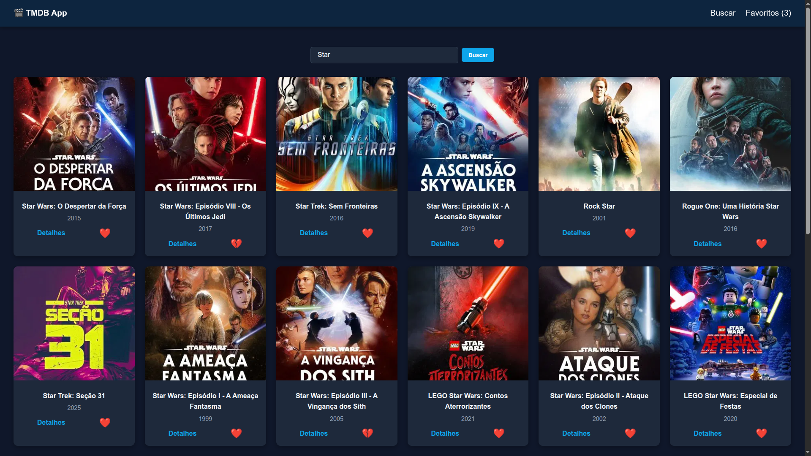
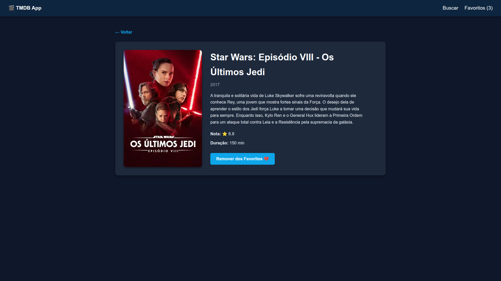

# 🎬 TMDB App

Uma aplicação desenvolvida em **React** que consome a API pública de filmes **TMDB** e permite que usuários busquem filmes, visualizem detalhes completos e mantenham uma lista de favoritos com persistência local.

##  🖼️ Demonstração

### Home


### Detalhes do Filme


---

## ✅ Objetivo do Projeto

Este projeto tem como finalidade aplicar conceitos de desenvolvimento web com React, Componentização, Consumo de API REST e persistência no navegador, fornecendo uma interface intuitiva para exploração de filmes.

---

## 🚀 Funcionalidades

| Funcionalidade | Descrição |
|--------------|------------|
| Busca de Filmes | O usuário pode pesquisar filmes por nome |
| Paginação | Navegação entre múltiplas páginas de resultados |
| Página de Detalhes | Mostra sinopse, diretor, elenco, avaliação e mais |
| Favoritos | Adicionar/Remover filmes da lista, armazenando no `localStorage` |
| Tratamento de Erros | Feedback de falhas de comunicação com a API |
| Loading States | Indicadores visuais enquanto dados são carregados |

---

## 🧩 Tecnologias Utilizadas

- **React.js**
- **React Router DOM**
- **Context API**
- **CSS / Hooks / Styled Components**
- **localStorage**

---

## 🛠️ Configuração do Ambiente

### Pré-requisitos

- Node.js 18+
- NPM instalado

### Instalação e Execução

```bash
npm install
npm run dev
```

### Configuração da API
Crie um arquivo .env na raiz do projeto com suas credenciais da API:

```bash
VITE_TMDB_API_KEY=sua_chave_aqui
```

📌 Obtenha sua chave gratuita em: https://www.themoviedb.org/

---

## 👩‍💻 Autora

**Vitória Barbosa**  
Estudante de Engenharia de Software  
[GitHub](https://github.com/vitoriabarbosa) | [LinkedIn](https://linkedin.com/in/vitoriabarbosaa)